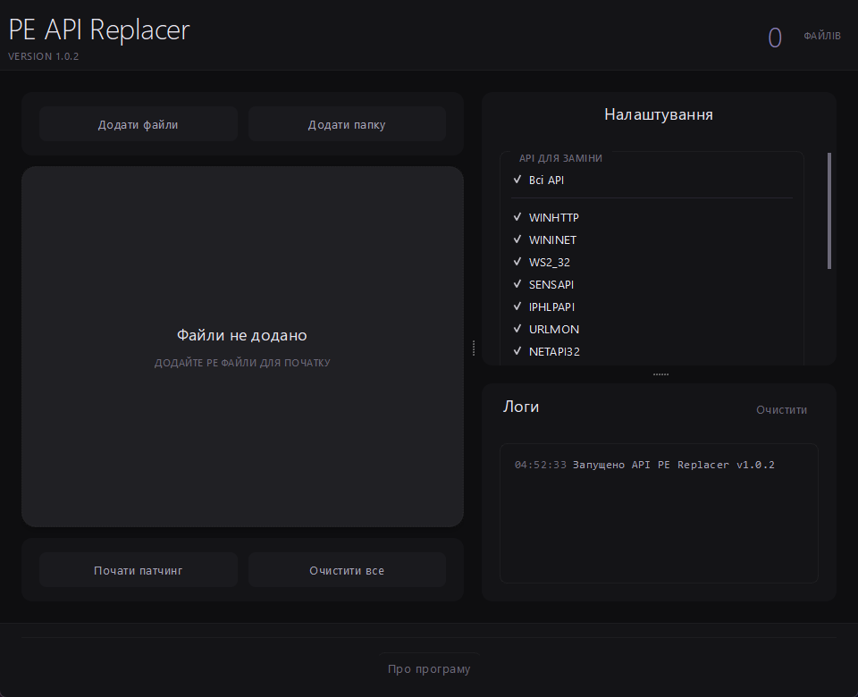

<div align="center">

### 👇

  <p>
    <a href="https://github.com/EXLOUD/PE-API-REPLACER/releases/download/v1.0.9/PE-API-REPLACER_v1.0.9.zip">
      
    </a>
  </p>

---

### 👀 Repository Stats

  

  **⭐ If this tool helped you, please consider giving it a star! ⭐**

---

  <h1>PE API Replacer</h1>
  
  <p>
    <a href="https://en.wikipedia.org/wiki/Portable_Executable">
      
    </a>
    <a href="https://www.python.org/downloads/">
      
    </a>
    <a href="https://riverbankcomputing.com/software/pyqt/">
      
    </a>
    <a href="https://github.com/mstorsjo/llvm-mingw/releases">
      
    </a>
  </p>
  
  
  
  [](https://github.com/EXLOUD/pe-api-replacer/issues)
  
  
  [](https://github.com/EXLOUD/pe-api-replacer/stargazers)

  Professional GUI tool for replacing API imports in PE files. Batch process EXE, DLL, VST, and SYS files with automatic backups and detailed logging.

</div>

---

## 🎯 Project Overview

**PE API Replacer** is a professional desktop application built on PyQt6 that performs binary patching of PE files (Portable Executable). The tool replaces calls to Windows API DLLs (for example, `winhttp.dll`, `wininet.dll`) with alternative DLLs (for example, `exhttp.dll`, `exinet.dll`) through modification of binary file data.

### 🎯 Main Goal
Provide a simple and secure method for batch redirecting API calls in executable files without requiring recompilation or detailed knowledge of PE internal structure.

---

## 🗂️ Project Architecture

### Three-Layer Design

```
┌──────────────────────────────────────────┐
│     UI Layer (PyQt6)                │  ← User Interface
├──────────────────────────────────────────┤
│  Business Logic (Threading Workers) │  ← Asynchronous Processing
├──────────────────────────────────────────┤
│  Binary I/O (pefile + OS)           │  ← File Operations
└──────────────────────────────────────────┘
```

### Main Components

#### **1. Configuration Module** (`config.py`)
Defines API replacement pairs in the `DLL_REPLACEMENTS` dictionary. Contains 10 groups of Windows APIs with their replacements.

**Critical Feature:** String length for binary replacement in PE format must exactly match the original. For padding, null bytes `\x00` are used.

**Configuration Example:**
```python
DLL_REPLACEMENTS = {
    1: {'name': 'WINHTTP', 'replacements': {
        b'winhttp.dll': b'exhttp.dll\x00',  # 11 bytes + 1 null = 12 bytes
    }},
    5: {'name': 'IPHLPAPI', 'replacements': {
        b'iphlpapi.dll': b'exiphl.dll\x00\x00',  # 12 bytes = 12 bytes
    }},
}
```

#### **2. Patching Core** 
- **`UniversalPEPatcher`** — Main class for modifications:
  - Loads PE files using the `pefile` library
  - Identifies patch locations in Import Address Table (IAT) and raw data
  - Performs binary replacements with length verification
  - Saves modified files while preserving PE structure

#### **3. Multithreading System**
```
ThreadManager (coordinator)
    ├─ PatcherWorker (main file processing)
    ├─ FileProcessorWorker (file analysis)
    ├─ FolderScannerWorker (folder scanning)
    └─ QThread (background thread)
```

**Signal-Slot System:**
- `log_signal` — Transmit log messages with color codes
- `file_processed` — Update file information in UI
- `progress_updated` — Update progress bar
- `finished` — Signal task completion
- `file_status_updated` — Change current file status

#### **4. UI Framework**
- **Refined Material Design** — Custom dark theme with violet accents
- **Splitter-based Layout:**
  - Left panel — File list with swipe-to-delete
  - Right panel — Settings + logs
- **Animated Components:**
  - File element swipe-to-delete
  - Deletion animation
  - Smooth state transitions

---

## 📄 Binary Patching Process

### Step 1: File Loading
```python
# Read file as bytearray for modification
with open(file_path, 'rb') as f:
    data = bytearray(f.read())

# Parse PE structure for analysis
pe = pefile.PE(data=data)
```

### Step 2: Finding Patchable Locations
**`check_if_patchable()` method:**
- Scans Import Directory Entry for matching DLL names
- Searches for binary sequences in file body
- Counts total replacements to perform

**Result:**
```
[IAT] winhttp.dll (1 occurrence)
[HEX] winhttp.dll (3 occurrences)
Total: 4 patchable locations
```

### Step 3: Performing Patching
**`patch_all()` method:**

**IAT Patching** (import table):
```python
# Find import entry for winhttp.dll
offset = pe.get_offset_from_rva(entry.struct.Name)
# Replace with exhttp.dll\x00 (14 bytes = 14 bytes)
data[offset:offset+14] = b'exhttp.dll\x00'
```

**Hex Patching** (raw data):
```python
# Search for b'winhttp.dll' in entire file
# Replace with b'exhttp.dll\x00' at each found location
# ⚠️ Only if lengths match!
```

### Step 4: File Saving
```python
# Use pefile for proper structure preservation
pe_patched = pefile.PE(data=modified_data)
pe_patched.write(output_path)
```

---

## 💾 Backup Strategy

```
Original.exe (original location)
    ↓ (backup copy)
backup/Original.backup1.exe
    ↓ (patching)
patched/Original.exe
    ↓ (optional: overwrite)
Original.exe (replaces original)
```

**Processing Flow:**
1. If `backup=True` — copy created in `backup/` folder
2. Patching performed in `patched/` folder
3. If `overwrite=True` — patched file replaces original
4. If both options enabled — protection duplicated

---

## 🌍 Localization System

### Translation Architecture

```
config.py / main.py
    ↓
TranslationManager
    ↓
load_language('en')
    ↓
lang_en.xml
    ↓
QWidget.setText(translator.get('key'))
```

### XML Translation Format (`lang_en.xml`)

```xml
<resources>
    <string name="app_title">PE API Replacer</string>
    <string name="log_processing_file">Processing: {0} {1}</string>
    <string name="summary_patched">{0} patched</string>
</resources>
```

### Parameterized Strings

```python
# Template with placeholders
template = "Found {0} files in {1} seconds"

# Parameter transmission
translator.get('found_files', 25, "10")
# → "Found 25 files in 10 seconds"
```

### Settings Persistence (`settings.ini`)

```ini
[Settings]
language = uk
show_dialog = False
```

---

## 🎨 UI/UX Features

### 1. Swipeable File Elements

```
File normalization.exe
───────────────────────────────────────────────
[Info] Ready              [Remove]
───────────────────────────────────────────────
                      👈 Drag left to delete
```

**Animation:**
- Swipe left → show delete icon (🗑️)
- Release → slide-out animation (300ms)
- Height reduction (250ms)
- Remove from UI

### 2. Folder Scanner with Dialog

**Functionality:**
- Recursively scans folder for PE files
- Automatically skips `patched/` and `backup/` folders
- Shows progress in real-time
- Allows cancellation of scan
- Lists skipped folders with reasons

**Supported Extensions:**
`.exe`, `.dll`, `.vst3`, `.vst`, `.sys`, `.ocx`, `.ax`

### 3. Color-Coded Logs

```
14:32:15 ℹ️  Started PE API Replacer v1.0.9
14:32:16 📄 Processing: [1/5] app.exe
14:32:18 ✅ [IAT] winhttp.dll → exhttp.dll
14:32:19 ✅ [HEX] winhttp.dll → exhttp.dll (3x)
14:32:20 ✅ Total: 4 changes
14:32:22 💾 Saved: patched/app.exe
14:32:25 ✅ Finished: 1 patched, 0 skipped, 0 with errors
```

**Color Semantics:**
- Gray — Time and metadata
- Blue — General information
- Green (✅) — Success
- Yellow (⚠️) — Warning
- Red (❌) — Error

### 4. About Program Dialog

- Shows version, author, GitHub link
- **Donation Addresses for Copy:**
  - Bitcoin, Ethereum, Monero, TON
  - USDT (TRC20, ERC20), USDC, Tron, BNB
- One-click copy to clipboard

---

## 🚀 General Patching Process

### User Flow Until Completion

```
1️⃣ User clicks "Start Patching"
    ↓
2️⃣ UI collects selected APIs (getChecked())
    ↓
3️⃣ Build active_replacements dictionary
    ↓
4️⃣ PatcherWorker launched in background thread
    ↓
5️⃣ For each file:
    ├─ PermissionsManager: check/modify permissions
    ├─ UniversalPEPatcher: load file
    ├─ check_if_patchable(): verify possibility
    ├─ patch_all(): perform replacements
    ├─ Save to backup/ (if enabled)
    ├─ Save to patched/
    ├─ Move to original (if overwrite=True)
    ├─ Emit file_status_updated
    └─ Emit progress_updated
    ↓
6️⃣ patching_done signal
    ↓
7️⃣ Clear UI, show summary
```

### Cancellation Handling

```
User clicks Cancel
    ↓
is_cancelled = True
    ↓
Current file finishes
    ↓
For all remaining files: status = 'cancelled'
    ↓
Remove processed files from list
    ↓
Show count of remaining files
    ↓
Allow user to continue patching
```

---

## 📊 Supported API Table

| # | Name | Original | Replacement |
|---|------|----------|-------------|
| 1 | WINHTTP | `winhttp.dll` | `exhttp.dll\x00` |
| 2 | WININET | `wininet.dll` | `exinet.dll\x00` |
| 3 | WS2_32 | `ws2_32.dll` | `exws2.dll\x00` |
| 4 | SENSAPI | `sensapi.dll` | `exsens.dll\x00` |
| 5 | IPHLPAPI | `iphlpapi.dll` | `exiphl.dll\x00\x00` |
| 6 | URLMON | `urlmon.dll` | `exurlm.dll` |
| 7 | NETAPI32 | `netapi32.dll` | `exnetapi.dll` |
| 8 | WSOCK32 | `wsock32.dll` | `exws.dll\x00\x00\x00` |
| 9 | WINTRUST | `wintrust.dll` | `extrust.dll\x00` |
| 10 | MSWSOCK | `mswsock.dll` | `exmsw.dll\x00\x00` |

**Note:** All replacements have null bytes for exact length correspondence.

---

## 🛠️ Technical Stack

### Frontend & Core
- **Python 3.10+** — Main application logic
- **PyQt6** — Cross-platform GUI framework

### Native API Emulators
- **C/C++** — High-performance substitute libraries
- **llvm-mingw 21.1.3** — Compiler for Windows PE
  - Clang/LLVM 21.1.3
  - MinGW-w64 runtime
  - Full Windows API support
  - Optimization for x64 binary generation

### Dependency Stack
```
requirements:
  - PyQt6 ≥ 6.0
  - pefile ≥ 2022.8.7
  - Python ≥ 3.10

optional (for development):
  - llvm-mingw 21.1.3 (C compiler for binary generation)
```

---

## 🚀 Quick Start

### Installation

```bash
# Cloning
git clone https://github.com/EXLOUD/PE-API-REPLACER.git
cd PE-API-REPLACER

# Installing dependencies
pip install PyQt6 pefile
```

### Launch

```bash
python main.py
```

### Basic Working Process

1. Click "Add Files" or "Add Folder"
2. Select APIs for replacement (checkboxes)
3. Adjust options (backup copy, overwrite)
4. Click "Start Patching"
5. Wait for completion

---

## 📜 Licensing

**GNU General Public License v3.0 (GPL-3.0)**

✅ Can be used, modified, distributed  
✅ Can be used commercially  
⚠️ Modified versions must also be GPL-3  
⚠️ Must provide source code to users  
⚠️ Must include full GPL-3 license text  

---

## 🤝 Contributing

Contributions are welcome! Please:

1. Fork the repository
2. Create a feature branch
3. Make commits
4. Submit to a branch
5. Open a Pull Request

For C/C++ contributions — compile with **llvm-mingw 21.1.3**.

---

## 📊 Project Statistics

- **Version:** 1.0.9
- **Status:** ✅ Stable
- **Dependencies:** Python 3.10+, PyQt6, pefile
- **License:** GPL-3.0
- **OS:** Windows, macOS, Linux
- **Architecture:** 64-bit PE files

---

## 🎓 Conclusion

**PE API Replacer** is a production-ready tool for binary patching with complete error handling, localization, professional UX design, and extended architecture.

<div align="center">

**[↑ Back to Top](#pe-api-replacer)**

</div>
